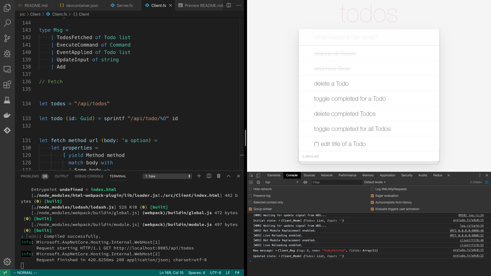

# Hands-on with SAFE Stack

## Prerequisites

### Source code

Clone or download this repository:

[https://github.com/theimowski/SAFE-TodoMVC-workshop](https://github.com/theimowski/SAFE-TodoMVC-workshop
)

### Visual Studio Code

For this workshop it's recommended to use [Visual Studio Code](https://code.visualstudio.com/download). You **should** be fine using different F# IDE (Visual Studio or Jetbrains Rider) but I **might** not be able to help in case of any problems with these.

Then you have two options of installing prerequisites: **Installing locally** or using **Remote Container**.

### Installing locally

This is the standard way - installing all dependencies on your development box. Follow [quickstart](https://safe-stack.github.io/docs/quickstart/) section of SAFE docs. Make sure to install Ionide extension for VS Code.

### Remote Container

Alternatively, you can use Docker and an extension for Visual Studio Code - [Remote Containers](https://marketplace.visualstudio.com/items?itemName=ms-vscode-remote.remote-containers). This allows your local VS Code to communicate with a remote Docker container that will have all other dependencies installed for you.

### VS Code Extensions

Following should be already preinstalled if you opted for the Remote Container option. Otherwise please install them - they'll prove useful during the workshop.

#### Ionide-fsharp

Required when working with local prerequisites. Provides language support for F#. [link](https://marketplace.visualstudio.com/items?itemName=Ionide.Ionide-fsharp)

#### Rest client

There's a `todos.http` file in the repository that shows what HTTP calls we should be able to make to our server. The "REST Client" extension for VS Code integrates nicely with this file allowing you to send the request directly from VS Code - [link](https://marketplace.visualstudio.com/items?itemName=humao.rest-client). Alternatively you can use any other HTTP client of your preference (e.g Postman)

#### Rainbow Brackets

This VS Code extension helps when working with Fable and React - it will colour corresponding opening and closing brackets, making it easier to keep track of bracket nesting level. [link](https://marketplace.visualstudio.com/items?itemName=2gua.rainbow-brackets)

## Get the app running

If you choose to install prerequisites locally:

1. Open repository directory in VS Code
1. Open VS Code terminal
1. Invoke `fake build --target run`
1. After a short delay, http://localhost:8080/ should open in your browser automatically

> For unix you might need to add dotnet tools dir to path: `export PATH="$HOME/.dotnet/tools:$PATH"`

If using Remote Container:

1. Open repository directory in VS Code
1. Click "Reopen in container" in a pop-up window, or invoke that action from Command Pallete
1. Open VS Code terminal, it should attach to the container
1. Invoke `fake build --target run`
1. Open http://localhost:8080/ in your browser

I also recommend opening developer tools in browser and placing your editor side by side with the browser - the watch mode makes it really nice to work without unnecessary window switching. To read the instructions, just open README.md in the editor



## SAFE Stack

* **S**aturn for back-end services in F#
* **A**zure as a hosting platform plus associated platform services (we'll skip this part during the workshop)
* **F**able for running F# in the web browser
* **E**lmish for client-side user interfaces

https://safe-stack.github.io/docs/

## Todo MVC

Original Todo MVC project (Client-side): http://todomvc.com/

Todo MVC for Server: https://www.todobackend.com

We combine both in single language (F#) using SAFE Stack.

## Key points

* Workshop will focus on the fact we can share code between Client and Server
* We'll not do the Azure part
* Check `solution` branch for example solution when in doubt or stuck. Every commit represents a single task (E.g. for `Client - add "destroy" button` task there's a commit with same message). Obviously feel free to provide your own implementation - just follow the specifications!
* The "display all Todos" and "add new Todo" features are already implemented on master branch which is the starting point of this workshop. I'll demonstrate how those features were implemented at the start of the workshop.
* We aim to complete at least features 1. and 2. during the workshop
* Will be great if you manage to implement also features 3. and 4.
* Feature (*) 5. is bit harder and will require more effort. Complete that feature anytime as a homework.

## Project structure & implementation details

* We'll be using a file-based database, just for demo purposes - the file is called `filestore.json` and it's indexed in Git - you can browse it to see all Todos.
* There's a `todos.http` file in repository which shows what HTTP calls our server should accept. After every feature make sure to check you can work with the application both via Web UI and the HTTP API!
* For simplicity, all server HTTP calls will return whole list of new Todos in JSON format.
* The script we run (`fake build -t run`) runs in a "watch" mode - this means that every time we save either of our source files, the app gets recompiled and rerun automatically. This applies to all Shared, Client and Server.
  * When saving Shared, both Client and Server will get recompiled
  * Ionide might sometimes not refresh Client/Server when editing Shared - if that's the case, try reopening the source file
  * The Client changes should be visible almost immediately
  * The Server recompiles a bit longer, so make sure to follow output of the build script - it's ready when following is printed:

```
Now listening on: http://0.0.0.0:8085
Application started. Press Ctrl+C to shut down.
```

* There are actually 2 servers running in development watch mode: our Saturn Web Server on 8085 and Webpack Dev Server on 8080 - we can focus just on the latter one
* We're interested in following files:
    * src/Shared/Shared.fs - code that will be shared (reused) between Client and Server (compiles to ASP.NET Core and JavaScript)
    * src/Client/Client.fs - code for Client (compiles to JavaScript)
    * src/Server/Server.fs - code for Server (compiles to ASP.NET Core)
    * src/Server/filestore.json - our file-based database
    * todos.http - running specifications for the Server
    * README.md - instructions
* We kinda follow the DDD approach - using Commands and Events for our Todo domain.
* We execute a Command both on Client and Server side - the Client updates immediately and doesn't wait for response (when the response comes back we just check we're in sync). We could execute the Commands only Server side and wait for a response, but then the Client application could be unresponsive!
* There's a pattern we'll follow throughout implementing all of the features:
  1. Client - change UI to adapt new feature, observe live changes in browser
  1. Shared - add new Command and Event and implement our Domain logic
  1. Client - add new Msg (triggered from UI) and execute proper Domain Command
  1. Client - call HTTP request for the given Command
  1. Client - trigger the Msg from UI
  1. Server - add a handler for HTTP request and execute proper Command

## 0. display Todos + add new Todo

These features are already implemented on master branch.

## 1. delete a Todo

### Client - add "destroy" button

In `viewTodo`, just after the `label` add a `button` with `destroy` class.

F# is whitespace sensitive (like e.g. Python), so make sure you got the indents right - `button` should start in same column as `label`.

When working with React and Elmish, square brackets used for creating lists can get cumbersome - make sure you get them right, otherwise you might experience unwanted compiler errors! First list applied to an element stands for its properties (React props) - that's where you should place the `ClassName`, and the second list stands for the element's children (empty in this case).

Note how a red cross appears in the UI when you move your mouse over a todo.

### Shared - add DeleteCommand and TodoDeleted event

`DeleteCommand` with Id of a Todo (`Guid` type) and `TodoDeleted` event with a `Todo`.

The `Command` and `Event` types are represented as what we call Discriminated Unions in F#. Think of them as the sum types from the Functional Programming jargon.

When I say "`DeleteCommand` with Id" I mean new Discriminated union case with a backing field - to add new case, we write `| NewCase` (remember about whitespace sensitivity!) and then (optionally) we list the types for backing fields after `of` keyword: `| NewCase of Guid`

### Shared - handle DeleteCommand

In `handle` function cover case for new command - use `List.find` to grab a Todo with given id and create `TodoDeleted` event.

`match {expression} with` is a pattern matching clause in F#. We can use it to cover all Discriminated Union cases - see how `AddCommand` case is covered and follow that pattern for `DeleteCommand`. You might use `let todo = ...` binding to find a Todo.

We also need to return `Result` - so for now assume `Ok` case. Use pipe (`|>`) operator to apply value on the left side to function on right hand side.

### Shared - apply TodoDeleted

In `apply` function cover case for new event - use `List.filter` to remove Todo that has the given Id.

Again using pattern matching, we'll cover case for `TodoDeleted`. The return type of `apply` is `Todo list` - last expression in F# is always the return value (no need for explicit `return` keyword).

We can "pipe" todos: `todos |> ...` to `List.filter` with a lambda function (predicate) checking for Id equality. Use `<>` operator to see if Ids are different.

### Client - add Destroy Msg

The `Destroy` Msg should come with Id of a Todo (`Guid`).

The Msg `type` in Client stands for all possible actions in our UI - make sure you can tell the difference between the Msg and Command, they're not the same!

When we click the red cross button, we'll need to trigger that Msg.

### Client - handle Destroy Msg

In `update` function handle new Msg - execute `DeleteCommand`.

Yet again pattern matching - follow the pattern as per `Add` Msg. We need to return a tuple of new model and Cmd (Cmd and our Command in Shared module are also different things - naming is hard!). To return a tuple simply do `model, cmd` (comma creates a tuple) - note that we don't need to change the model here so we return it unchanged.

To execute `DeleteCommand` we first need to create it by passing the Id of a Todo and then calling `execute` function.

### Client - trigger Destroy Msg

Add `OnClick` event handler to the "destroy" button and `dispatch` a `Destroy` msg with Todo's Id.

`OnClick` is another React prop that we can add. It takes a function as a parameter - same as event handlers in `viewInput` function above.

Follow the pattern from `viewInput` to dispatch the `Destroy` Msg. To create the Msg you'll need to pass the Todo's Id - you can get it by using dot notation (`todo.Id`) - `todo` is a parameter to our `viewTodo` function.

### Client - send request for DeleteCommand

In `request` function handle `DeleteCommand` - call DELETE /todo/{id} without body.

This is where we call HTTP request to our server. Follow the pattern from `AddCommand` case: use `fetch` function with proper parameters. To construct /todo/{id} url, call `todo` function with the given Id.

The `fetch` function takes optional request body as last parameter. For this call we don't need the body so pass `None` as last param.

By now we should be able to delete a todo from the Web app, however we are still missing proper handling on server side, so the change will not be persisted.

### Server - add handler for DeleteCommand

Add DELETE handler to `todoRouter` and execute `DeleteCommand`.

Follow the pattern for POST from `todosRouter`. We don't need to do `BindModelAsync` as there's no request body. Just replace `AddCommand` with `DeleteCommand`. We can take the Id from `todoRouter` parameter.

Now we should be able to remove a Todo server-side, but still missing error handling.

### Shared - add TodoNotFound error

In `handle` function replace `List.find` with `List.tryFind` to properly handle missing todo error.

As one could call our API for a non-existing Todo, we need to handle that case. After using `List.tryFind` we can utilise pattern matching to see if Todo exists (`Some todo` case) or not (`None` case) - correspondingly call `Ok` or `Error` (see `AddCommand`).

### Server - map TodoNotFound to HTTP response

In `execute` function for `TodoNotFound` return HTTP 404 `notFound`.

If we call DELETE /todo/{id} multiple times (from REST Client), we'll get a 500 Internal Error due to not complete pattern matching. Fix that by handling `TodoNotFound` inside `execute` function - follow pattern for `TodoIdAlreadyExists`.

## 2. toggle completed for a Todo

### Client - add "toggle" checkbox

In `viewTodo`, just before `label` add an `input` with `checkbox` type and `toggle` class.

Use `Type` and `ClassName` React props. Note `input` tag can't have children so use only first list for properties and skip the second list!

Observe how a rounded checkbox is added in front of the label for each Todo.

### Shared - add PatchCommand

Add `PatchDTO` type with `Completed` field and add `PatchCommand` with a tuple of `Guid` and `PatchDTO`.

For `PatchDTO` use Record type - same as was used for `AddDTO`. Record is the "product type" in F# and can have multiple named fields.

`PatchDTO` should have a single `Completed` field of `bool` type. `PatchCommand` should take a tuple as a backing field : `Guid * PatchDTO` - the asterisk stands for defining a tuple in type signature.

### Shared - add TodoPatched

Add `TodoPatched` event and cover new cases for `handle` and `apply`.

The `TodoPatched` event can have whole `Todo` as a backing field - it will make it simpler for `apply` function. For `handle` and `PatchCommand` remember to check if todo exists (like for `DeleteCommand`).

When pattern matching, you can deconstruct a tuple like this: `| PatchCommand (id, patchDTO) ->`.

To return a copy of a Todo with single field changed use following syntax: `{ todo with Completed = ... }`.

For `TodoPatched` in `apply` - use `List.map`, check if Id matches and return either current or patched value of a Todo - you can use `if ... then ... else ...`.

### Client - add SetCompleted Msg

Add `SetCompleted` Msg with Id and flag (`bool`). In `update` function handle this case and `execute` the `PathCommand`.

Again use a tuple for backing field of `SetCompleted` (`Guid * bool`). In `update` follow pattern from `Add` Msg - create an instance of `PatchDTO`, pass it to `PatchCommand` and execute.

### Client - trigger SetCompleted Msg

Use `Checked` property to mark the "toggle" checkbox when corresponding Todo is completed.
Add also `OnChange` handler and `dispatch` `SetCompleted` Msg.

`Checked` React prop takes a flag as argument - use `todo.Completed` to determine if it should be checked or not. To construct instance of `SetCompleted` you need to pass a tuple of Todo's Id an **negated** value of it's current Completed status - use `not` function (`bool -> bool`).

### Client - send request for PatchCommand

Handle `PatchCommand` in `request` function.

Call PATCH /todo/{id} with `PatchDTO` as body (`Some patchDTO`)

### Server - add handler for PatchCommand

The handler should be for PATCH http method to `todoRouter`.

Read `PatchDTO` from the request - use `ctx.BindModelAsync<PatchDTO>()`. Construct value of `PatchCommand` and execute it, using same function as for `delete`.

## 3. delete completed Todos

### Client - add "Clear completed" button

In `viewControls` function, just after `span` with "X items left" add a `button` with `clear-completed` class and "Clear completed" inner text child node - for that use `str "text"`.

`ClassName` React Prop goes into first list, and the child text node - into second.

### Client - conditionally hide the button

Hide the "Clear completed" button when none of Todos is Completed

Use `Hidden` React prop and `todosCompleted` counter defined above.

### Shared - add DeleteCompletedCommand and CompletedTodosDeleted

Those cases do not carry any information with themselves, so don't need to add any backing field. Cover new cases in `handle` and `apply`.

### Client - add ClearCompleted Msg

Execute `DeleteCompletedCommand` in `update` for the Msg, call DELETE /todos for the command in `request` without request body

### Client - trigger ClearCompleted Msg

Add `OnClick` handler to the "Clear completed" `button` and `dispatch ClearCompleted` Msg

### Server - add handler for DeleteCompletedCommand

The handler should be of DELETE method in `todosRouter`. Execute `DeleteCompletedCommand` in the handler.

## 4. toggle completed for all Todos

### Client - add "toggle-all" checkbox and label

We need 2 new UI elements - in `viewTodos` function, before `ul` add 2 elements: 1) `input` with `checkbox` type and `toggle-all` class, 2) `label` without any props or children

### Shared - add PatchAllCommand and AllTodosMarkedAs

`PatchAllComand` should come with `PatchDTO`, and the `AllTodosMarkedAs` event with bool flag. Cover the cases in `handle` and `apply`

### Client - add SetAllCompleted Msg

The new Msg should have a bool flag. Execute `PatchAllCommand` for the Msg - similar to PatchCommand for single Todo. Call PATCH /todos with `PatchDTO` body for the command.

### Client - trigger SetAllCompleted Msg

Add `OnClick` handler to the "toggle-all" **label (!)**.

The handler needs to be attached to `label` as it's the element that is visible in the browser's window. Then `dispatch SetAllCompleted` Msg. `SetAllCompleted` needs a proper flag - check if all todos are completed (`List.forall` might get handy) and pass that value as argument to the Msg.

### Client - bind "toggle-all" checkbox

Use `Checked` property for "toggle-all" checkbox.

`Checked` needs to be true when all Todos are completed. Also add a dummy `OnChange` handler to checkbox (can use `ignore` function) - this is so that we overcome React warnings about uncontrolled inputs (we already attached event handler to the label).

### Server - add handler for PatchAllCommand

Http PATCH for todosRouter.

Read `PatchDTO` from the request and call `PatchAllCommand`

## 5. (*) edit title of a Todo

The specifications for this task are as follows ([reference](https://github.com/tastejs/todomvc/blob/master/app-spec.md#editing)):

* After double clicking on a label, the Todo should go into editing mode
* Editing mode means that instead of the label, a text input is displayed
* You can edit the Todo's title by changing value of the input and using Enter key
* When editing the title and clicking Esc, changes should be aborted
* It should call PATCH /todo/{id} (see `todos.http` file)

This one is a bit harder and requires bit more work on the Client side.
Steps described here will not be as precise as before, and they are not necessarily in the order, rather just general tips, so treat this task as a kind of challenge!

* Client - You'll need to model the editing mode - one way for doing that is adding `Editing` field to our `Model` and keeping track of the Id and temporary editing value
* Client - More than one Msg is needed to implement this feature - you might create Msgs for following:
  * start editing mode,
  * abort editing mode,
  * set editing value,
  * save changes.
* Client - in `viewTodo`:
  * `editing` class should be present on `li` when a Todo is in editing mode
  * the double-click handler should be attached to `label`
  * the edit `input` should be child of `li` element
  * the input should have `edit` class, `valueOrDefault` set to the temporary value, and subscribe to `OnChange` and `OnKeyDown` events
* Shared - to reuse the `PatchCommand` for both toggling Completed and editing Title, you might make the `PatchDTO` have two `option` fields for Completed and Title - the serialization will simply set the value to `None` if it's missing in JSON. This means that it's probably a good idea to extract a separate type for `PatchAllCommand` - e.g. `PatchAllDTO` with single "Completed" field

## 6. (**) extras

Following are left as an optional exercises, they are possible improvements on what we already have, and some are part of the original TodoMVC project specifications.
They might be bit harder to do as I haven't prepared sample code for those (yet).

* add validation that Todo's title should never be empty
* when editing a Todo, respect also `Blur` event to save changes
* implement Routing as per [TodoMVC specs](https://github.com/tastejs/todomvc/blob/master/app-spec.md#routing) - use [Fable.Elmish.Browser](https://elmish.github.io/browser/index.html) package
* make the edit input focused when entering editing mode - one way of doing that is using [React Refs](https://pl.reactjs.org/docs/refs-and-the-dom.html) - you'll need an advanced usage of `Fable.React` as described e.g. [here](https://fable.io/blog/Announcing-Fable-React-5.html)
* deploy to Azure App Engine - the project has been created with `arm-template.json` file, so if you have an Azure account follow [these](https://safe-stack.github.io/docs/template-appservice/) steps to deploy the TodoMVC app to cloud!